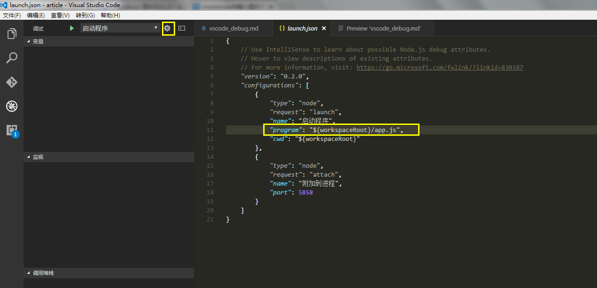
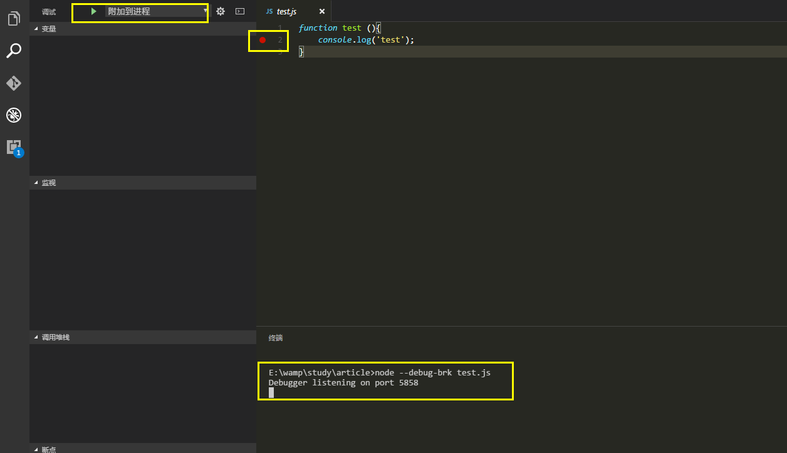

# vscode调试javascript代码

## 调试分类
* Launch模式: 直接调试，vscode直接运行js文件，下断点进行调试。
* Attach模式: 附加进程调试，需要先运行node文件，并附带`--debug-brk`参数，进行调试。

## Launch模式
1. 在代码中创建断点，如`app.js`。
2. 进入调试模式(`ctrl+shift+D`)，点击配置，系统会自动创建launch.json文件。
3. 修改入口文件，如`app.js`,点击左上角的绿色启动按钮即可。注:系统默认下拉选项为`启动程序`。

## Attach模式
1. 在代码中创建断点
2. `ctrl + ~` 启动终端，输入代码`node --debug-brk=5858 test.js` 端口号默认为5858，此时debugger进程在5858端口监听。

3. 在调试模式下(`ctrl+shift+D`)，选择`附加到进程`选项，点击绿色箭头启动，此时vscode通过端口与node进行远程调试。

## 其他
* `${workspaceRoot}`等变量由vscode定义，具体可参考[官方文档](http://code.visualstudio.com/Docs/editor/debugging)。
* `Node`更多调试方法可查看[文章](http://www.cnblogs.com/dolphinX/p/3485345.html)